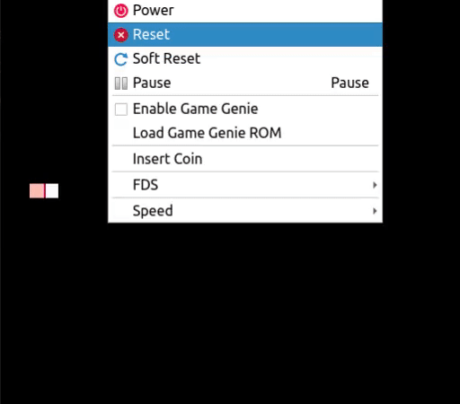
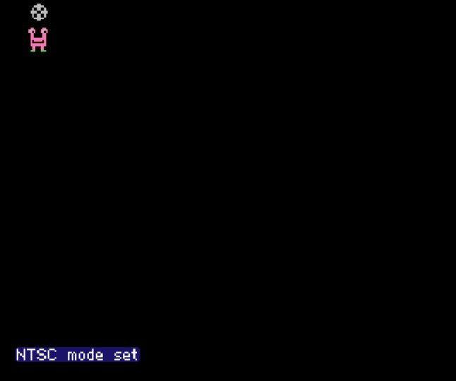

# NES game - ___________ NES Edition
Project in Assembly Programming 
memory tester[1]  
an hdd bad blocks tester[2] 
a boot loader[3] 

### Version 4 - "Intro and Info screen done, beginning of Gameplay" 

### Version 3 - "Splash and Intro screen almost over" 
 

### Version 2 - "Sprite loaded" 
 

### Version 1 - "Graphics beginning" 
 

### TODO:
- [ ] optimizuj kod za 1 second wait
- [ ] sredi da se kod intro screen ceka dok ne kliknes Start
- [ ] zavrsi intro screen i pomeranje harija
- [ ] sredi da se na info screenu scrolluje kad kliknes A
- [ ] uredi malo intro screen
- [ ] ostavi za jedan dan da implementiras gameplay posle info
- [ ] use this as a template for a game jam with vintage topic
- [ ] setup C compiler and working makefile
- [ ] use intro as a loader to the game, the small character can go on start/options/exit spots
- [ ] game starts and changes to gameplay directory
